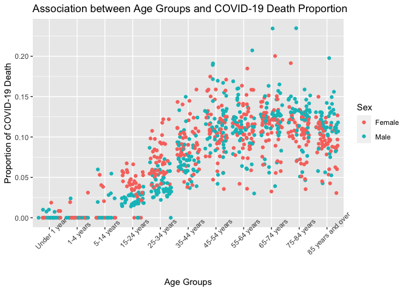
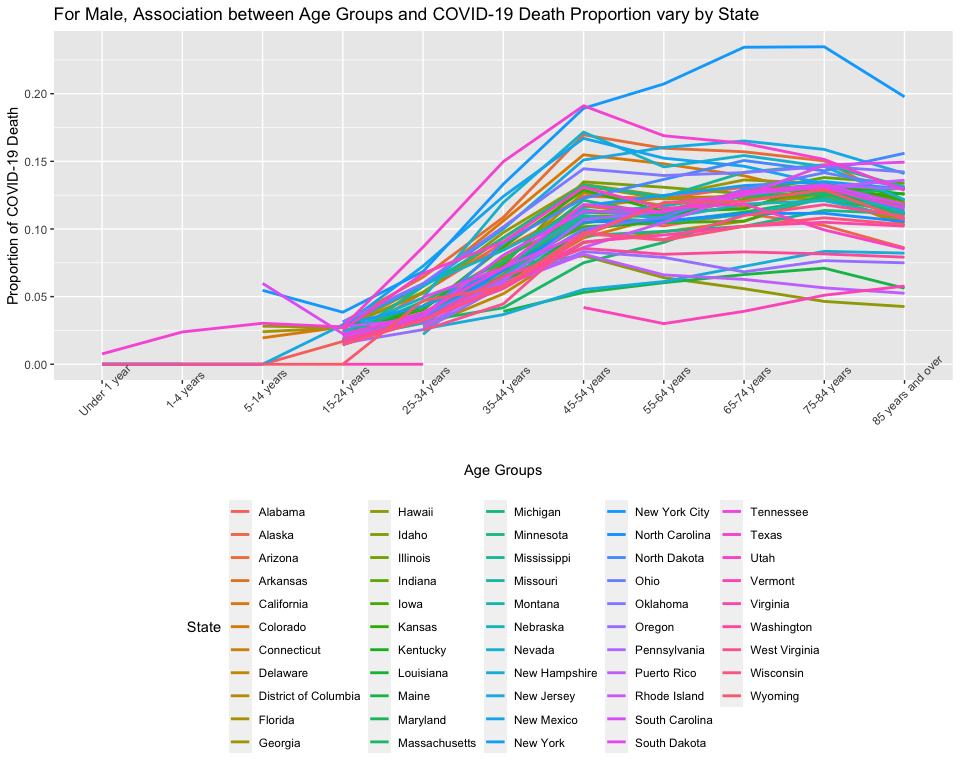
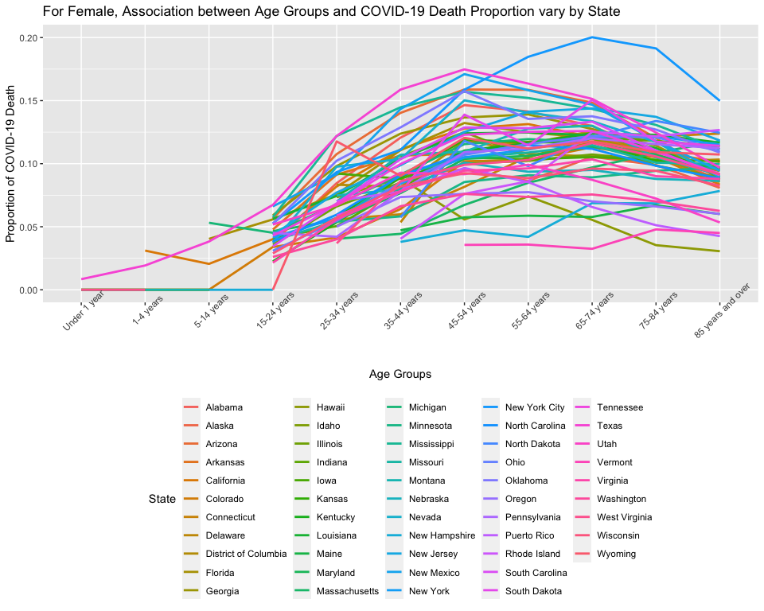

# Introduction

## Background on the dataset

Older people have higher rates of comorbidities and may experience more inflammatory responses. Therefore, when older people had COVID-19, the COVID-19 deaths proportion of total deaths for elderly will be higher than the younger. Herein, we aimed to explore the association between age and 
the deaths involving coronavirus disease 2019(COVID-19).

The raw dataset we used is from nation center for health statistics. Each row of 
dataset is COVID-19 deaths by sex, age, state, year and month. 
We will include sex and state variables in our dataset, because the COVID-19
death may be sex-specific, and the vaccine received situation may vary from different
states. Including sex and state variables can help us stratify the COVID-19 death proportion in 
different age groups. So variables to be used are date of data period, sex, 
state, age group, COVID-19 death, total death. 


## Formulated question
**What is the association of age groups with COVID-19 death proportion of total death?**


# Method

## Where the data acquired
**Provisional COVID-19 Deaths by Sex and Age**

- download link: https://data.cdc.gov/api/views/9bhg-hcku/rows.csv?accessType=DOWNLOAD

### needed package


### read data

```r
dat1 <- "death_by_sex_age.csv"
if (!file.exists(dat1))
  download.file("https://data.cdc.gov/api/views/9bhg-hcku/rows.csv?accessType=DOWNLOAD", destfile = dat1)

death_by_sex_age <- data.table::fread("death_by_sex_age.csv")
# summary(death_by_sex_age)
```
## clean raw dataset

**Raw dataset contains the COVID-19 deaths data in different period from 01/01/2020 to 10/15/2022. Here, we used the data from 01/01/2020 to 10/15/2022. This period contains the most deaths data.**


```r
dat1 <- death_by_sex_age[`Start Date` == "01/01/2020" & `End Date` == "10/15/2022"]
# str(dat1)
```
**In the following process, we will stratify the COVID-19 deaths rates by sex and state. But sex variable includes the value of "all Sexes". State variable includes the value of "United States". Age Group includes the value of "All Ages". We need to delete those useless value.**


```r
dat1 <- dat1[Sex != "All Sexes" & `Age Group` != "All Ages" & State != "United States"]
#unique(dat1$`Age Group`)
```

**When we check the value of Age group variable, we find some of age groups are overlapped. So we need to remove some of age group**


```r
dat1 <- dat1[`Age Group` != "0-17 years" & `Age Group` != "18-29 years" & `Age Group` !="30-39 years" & `Age Group` != "40-49 years" & `Age Group` != "50-64 years"]
```

**Age group is a ordinal categorical variable. The different age group have a clear order. So we use "order" function to tranform age group variable to ordered factor.**

```r
dat1 <- dat1[, `Age Group` := ordered(`Age Group`, levels = c(
    "Under 1 year","1-4 years"  ,    "5-14 years",     
 "15-24 years"  ,    "25-34 years"   ,    "35-44 years"    ,  
 "45-54 years"  ,    "55-64 years"    ,   "65-74 years"    ,  
"75-84 years"   ,    "85 years and over"
))]
```


**We also need to calculate the COVID-19 deaths proportion of total death.**

```r
dat1[, "COVID-19 deaths proportion" := `COVID-19 Deaths`/`Total Deaths`]
summary(dat1$`COVID-19 deaths proportion`)
```

```
##    Min. 1st Qu.  Median    Mean 3rd Qu.    Max.    NA's 
## 0.00000 0.05313 0.09442 0.08525 0.11811 0.23469     276
```

**Checking the distribution of the proportion of COVID-19 death, the proportion ranges from 0 to 0.2347. There is no abnormal value in the proportion of COVID-19 death.**

**I used 'summary' to check the distribution of continous variables, like "COVID-19 deaths proportion". Using 'unique' to check value of target categorical variable.**

### Exploratory Data Analysis

**First, Check the dimensions and headers and footers of the data**

```r
dim(dat1)
```

```
## [1] 1166   17
```

```r
#head(dat1)
#tail(dat1)
```

**Check the variable types in the data**


```r
# str(dat1)
```

**Take a closer look at some/all of the variables**


```r
summary(dat1$`COVID-19 deaths proportion`)
```

```
##    Min. 1st Qu.  Median    Mean 3rd Qu.    Max.    NA's 
## 0.00000 0.05313 0.09442 0.08525 0.11811 0.23469     276
```

```r
#unique(dat1$`Age Group`)
#unique(dat1$Sex)
#unique(dat1$State)
```

**Using "summary" to check the distribution of of the proportion of COVID-19 death, the proportion ranges from 0 to 0.2347. There is no abnormal value in the proportion of COVID-19 death. The most of proportion of COVID-19 death fall into the range of 0.0465 to 0.1152. After cleanning the data, sex, age group and state variables look good.**

### Conduct some summary statistics to answer the initial question

**Calculate means of COVID-19 death proportion in different age groups**

```r
dat2 <- death_by_sex_age[`Start Date` == "01/01/2020" & `End Date` == "10/15/2022" & State == "United States" & Sex == "All Sexes" & `Age Group` != "All Ages"]
dat2[, "COVID-19 Death Proportion" := `COVID-19 Deaths`/`Total Deaths`]

dat2 <- dat2[`Age Group` != "0-17 years" & `Age Group` != "18-29 years" & `Age Group` !="30-39 years" & `Age Group` != "40-49 years" & `Age Group` != "50-64 years"]

dat2 <- dat2[, `Age Group` := ordered(`Age Group`, levels = c(
    "Under 1 year","1-4 years"  ,    "5-14 years",     
 "15-24 years"  ,    "25-34 years"   ,    "35-44 years"    ,  
 "45-54 years"  ,    "55-64 years"    ,   "65-74 years"    ,  
"75-84 years"   ,    "85 years and over"
))]

dat2[, .(`Age Group`, `COVID-19 Death Proportion`)]
```

```
##             Age Group COVID-19 Death Proportion
##  1:      Under 1 year               0.006702214
##  2:         1-4 years               0.018847761
##  3:        5-14 years               0.025803250
##  4:       15-24 years               0.028214104
##  5:       25-34 years               0.055520937
##  6:       35-44 years               0.092054344
##  7:       45-54 years               0.125970034
##  8:       55-64 years               0.123394626
##  9:       65-74 years               0.126364312
## 10:       75-84 years               0.120594075
## 11: 85 years and over               0.104664188
```

**From the above list of COVID-19 Death Proportion, with increase of age, the proportion of COVID-19 death increased. However, when age beyond 74 years, the proportion of COVID-19 death decreased. **

# Preliminary Results

画个总人口 的，age和cov的图，用柱状图
画一个sex specific 的boxplot， 比较两个的中位数
画sex specific 的barchart
比较所有州的boxplot
画state specific 的barchart

## Summary Statistics Table


```r
overall_age_cov <- dat2[, .(`Age Group`, `COVID-19 Death Proportion`)]
knitr::kable(overall_age_cov, caption = "Table 1  COVID-19 Death Proportion in different Age Group")
```


Table: Table 1  COVID-19 Death Proportion in different Age Group

|Age Group         | COVID-19 Death Proportion|
|:-----------------|-------------------------:|
|Under 1 year      |                 0.0067022|
|1-4 years         |                 0.0188478|
|5-14 years        |                 0.0258033|
|15-24 years       |                 0.0282141|
|25-34 years       |                 0.0555209|
|35-44 years       |                 0.0920543|
|45-54 years       |                 0.1259700|
|55-64 years       |                 0.1233946|
|65-74 years       |                 0.1263643|
|75-84 years       |                 0.1205941|
|85 years and over |                 0.1046642|

**From the table of COVID-19 Death Proportion, with increase of age, the proportion of COVID-19 death increased. However, when age beyond 74 years, the proportion of COVID-19 death decreased. **


```r
dat3 <- death_by_sex_age[`Start Date` == "01/01/2020" & `End Date` == "10/15/2022" & State == "United States" & Sex != "All Sexes" & `Age Group` != "All Ages" & `Age Group` != "0-17 years" & `Age Group` != "18-29 years" & `Age Group` !="30-39 years" & `Age Group` != "40-49 years" & `Age Group` != "50-64 years"]
dat3[, "COVID-19 Death Proportion" := `COVID-19 Deaths`/`Total Deaths`]

sex_age_cov <- dat3[, .(`Age Group`, `COVID-19 Death Proportion`), by = Sex]
knitr::kable(sex_age_cov, caption = "Table 2  COVID-19 Death Proportion in different Age Group stratifed by Sex")
```


Table: Table 2  COVID-19 Death Proportion in different Age Group stratifed by Sex

|Sex    |Age Group         | COVID-19 Death Proportion|
|:------|:-----------------|-------------------------:|
|Male   |Under 1 year      |                 0.0066354|
|Male   |1-4 years         |                 0.0173182|
|Male   |5-14 years        |                 0.0221706|
|Male   |15-24 years       |                 0.0228649|
|Male   |25-34 years       |                 0.0482183|
|Male   |35-44 years       |                 0.0870970|
|Male   |45-54 years       |                 0.1281349|
|Male   |55-64 years       |                 0.1238869|
|Male   |65-74 years       |                 0.1295856|
|Male   |75-84 years       |                 0.1298371|
|Male   |85 years and over |                 0.1168606|
|Female |Under 1 year      |                 0.0067847|
|Female |1-4 years         |                 0.0208473|
|Female |5-14 years        |                 0.0309774|
|Female |15-24 years       |                 0.0428827|
|Female |25-34 years       |                 0.0729984|
|Female |35-44 years       |                 0.1014746|
|Female |45-54 years       |                 0.1223170|
|Female |55-64 years       |                 0.1226145|
|Female |65-74 years       |                 0.1219349|
|Female |75-84 years       |                 0.1105456|
|Female |85 years and over |                 0.0967228|

**From the sex specific table of COVID-19 Death Proportion in different Age Group, there is a difference of COVID-19 Death Proportion between male and female.**


```r
dat4 <- death_by_sex_age[`Start Date` == "01/01/2020" & `End Date` == "10/15/2022" & State != "United States" & Sex == "All Sexes" & `Age Group` == "All Ages"]
dat4[, "COVID-19 Death Proportion" := `COVID-19 Deaths`/`Total Deaths`]
state_cov <- dat4[, .(`State`, `COVID-19 Death Proportion`)]
knitr::kable(state_cov, caption = "Table 3 Average COVID-19 Death Proportion in different states")
```


Table: Table 3 Average COVID-19 Death Proportion in different states

|State                | COVID-19 Death Proportion|
|:--------------------|-------------------------:|
|Alabama              |                 0.1147603|
|Alaska               |                 0.0924925|
|Arizona              |                 0.1307363|
|Arkansas             |                 0.1106547|
|California           |                 0.1131166|
|Colorado             |                 0.1063122|
|Connecticut          |                 0.1169624|
|Delaware             |                 0.1014794|
|District of Columbia |                 0.1073365|
|Florida              |                 0.1091620|
|Georgia              |                 0.1171028|
|Hawaii               |                 0.0478029|
|Idaho                |                 0.1101975|
|Illinois             |                 0.1060629|
|Indiana              |                 0.1163435|
|Iowa                 |                 0.1068533|
|Kansas               |                 0.1097400|
|Kentucky             |                 0.1152206|
|Louisiana            |                 0.1097300|
|Maine                |                 0.0603097|
|Maryland             |                 0.1037219|
|Massachusetts        |                 0.1065845|
|Michigan             |                 0.1082082|
|Minnesota            |                 0.0967403|
|Mississippi          |                 0.1297354|
|Missouri             |                 0.1045454|
|Montana              |                 0.1103229|
|Nebraska             |                 0.0992198|
|Nevada               |                 0.1289833|
|New Hampshire        |                 0.0697577|
|New Jersey           |                 0.1383731|
|New Mexico           |                 0.1275810|
|New York             |                 0.1197277|
|New York City        |                 0.1882537|
|North Carolina       |                 0.0999043|
|North Dakota         |                 0.1286867|
|Ohio                 |                 0.1162397|
|Oklahoma             |                 0.1305380|
|Oregon               |                 0.0688596|
|Pennsylvania         |                 0.1150481|
|Rhode Island         |                 0.1176014|
|South Carolina       |                 0.1129522|
|South Dakota         |                 0.1228799|
|Tennessee            |                 0.1113051|
|Texas                |                 0.1397608|
|Utah                 |                 0.0861056|
|Vermont              |                 0.0426530|
|Virginia             |                 0.0930028|
|Washington           |                 0.0730594|
|West Virginia        |                 0.1005462|
|Wisconsin            |                 0.0923225|
|Wyoming              |                 0.1095171|
|Puerto Rico          |                 0.0568802|

**From the average COVID-19 Death Proportion in different states, we can find that there is a difference of average COVID-19 Death Proportion between different states, which caused by the medical condition and vaccine popularity.**

## Exploratory Figures

**First, we do scatter plot of age group and COVID-19 deaths proportion. **

```r
dat1 %>%
  ggplot() +
  geom_point(mapping = aes(y = `COVID-19 deaths proportion`, x = `Age Group`, color = Sex), position = "jitter") + 
  theme(axis.text.x = element_text(angle = 45)) + 
  labs(title = "Association between Age Groups and COVID-19 Death Proportion", y = "Proportion of COVID-19 Death", x = "Age Groups")
```

```
## Warning: Removed 276 rows containing missing values (geom_point).
```

<!-- -->

**As shown in graph, The proportion of COVID-19 deaths increase within the higher age group. However, for female whose age beyond 75 years, their proportion of COVID-19 deaths decrease a little. Because gender may affect the association between COVID-19 deaths proportion and age group, we will stratify the association between COVID-19 deaths proportion and age group by gender.**

**We generate two spaghetti plots of proportion of COVID-19 deaths versus age groups in different state group. Because the medical condition and vaccine popularity vary from states, we concentrate on the relationship between proportion of COVID-19 deaths and age group in different states.**

```r
dat1[Sex == "Male"] %>%
  ggplot(mapping = aes(y = `COVID-19 deaths proportion`, x = `Age Group`, group = State, color = State)) +
  #geom_point(mapping = aes(y = `COVID-19 deaths proportion`, x = `Age Group`), position = "jitter") + 
  geom_line(size = 1) +
  theme(axis.text.x = element_text(angle = 45)) + 
  labs(title = "For Male, Association between Age Groups and COVID-19 Death Proportion vary by State", y = "Proportion of COVID-19 Death", x = "Age Groups") +
  theme(legend.position = "bottom")
```

```
## Warning: Removed 92 row(s) containing missing values (geom_path).
```

<!-- -->

```r
dat1[Sex == "Female"] %>%
  ggplot(mapping = aes(y = `COVID-19 deaths proportion`, x = `Age Group`, group = State, color = State)) +
  #geom_point(mapping = aes(y = `COVID-19 deaths proportion`, x = `Age Group`), position = "jitter") + 
  geom_line(size = 1) +
  theme(axis.text.x = element_text(angle = 45)) + 
  labs(title = "For Female, Association between Age Groups and COVID-19 Death Proportion vary by State", y = "Proportion of COVID-19 Death", x = "Age Groups") +
  theme(legend.position = "bottom")
```

```
## Warning: Removed 99 row(s) containing missing values (geom_path).
```

<!-- -->

**From these two spaghetti plots of proportion of COVID-19 deaths versus age groups, we find the increase rate of proportion of COVID-19 deaths for male is fast from 15 years old to 54 years old. When age beyond 55 years, the increase rate of proportion of COVID-19 deaths get slow. For female, there is no obvious break point of the increase rate of proportion of COVID-19 deaths. At about 55 years old, the change of COVID-19 deaths proportion converted from increase to decrease. **

# Conclusion

**There is a association between patients' age groups and the proportion of COVID-19 deaths. With the increase of patients' age, the proportion of COVID-19 deaths get higher. However, this relationship was sex-specific. The increase rate of COVID-19 deaths proportion for male is fast from 15 years old to 54 years old. When age beyond 55 years, the increase rate of COVID-19 deaths proportion get slow. For female, there is no obvious break point of the increase rate. Around 55 years old, the change of COVID-19 deaths proportion converted from increase to decrease.**


